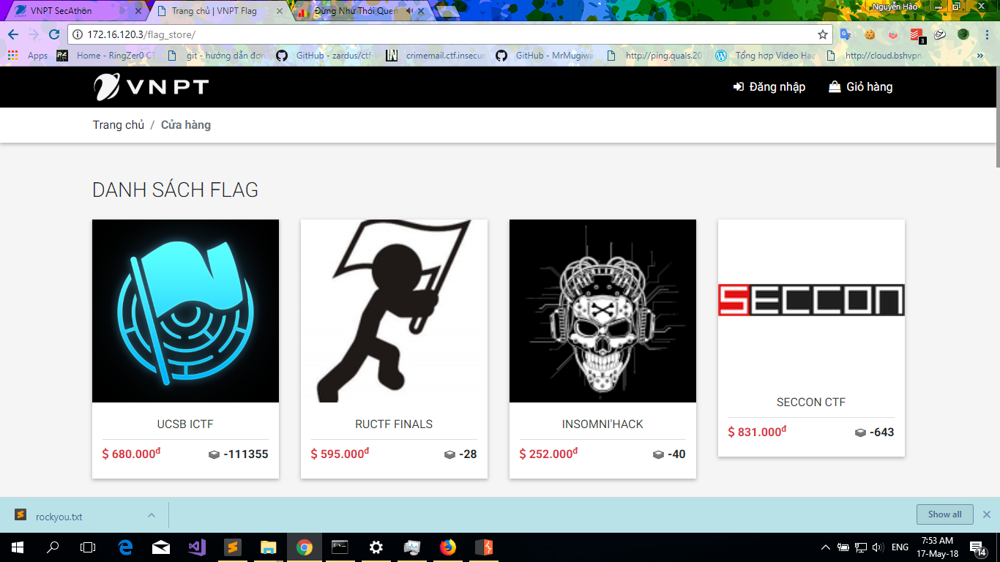
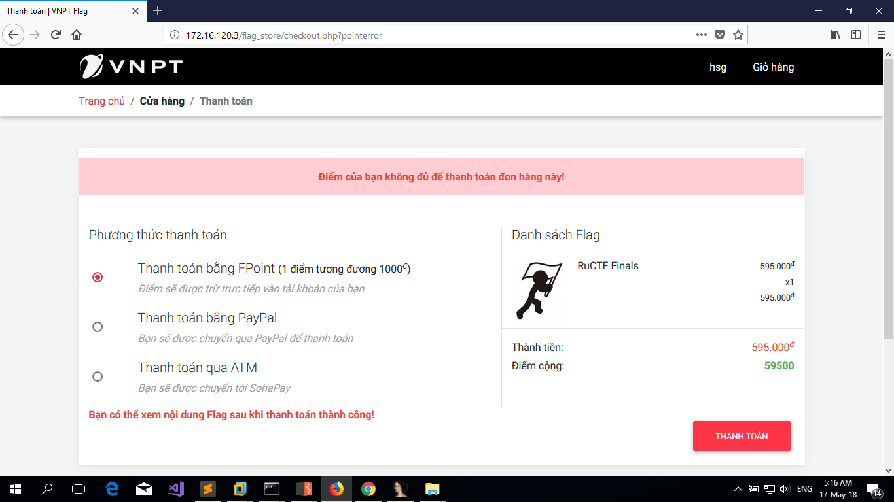
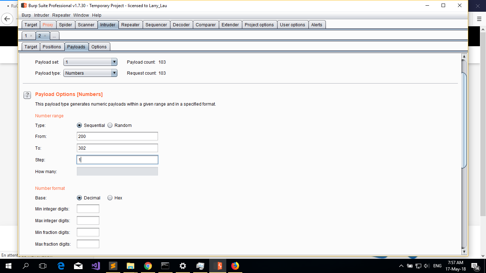
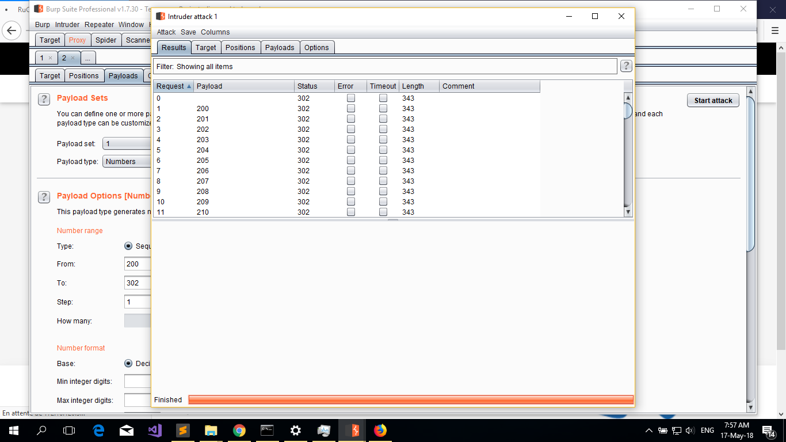
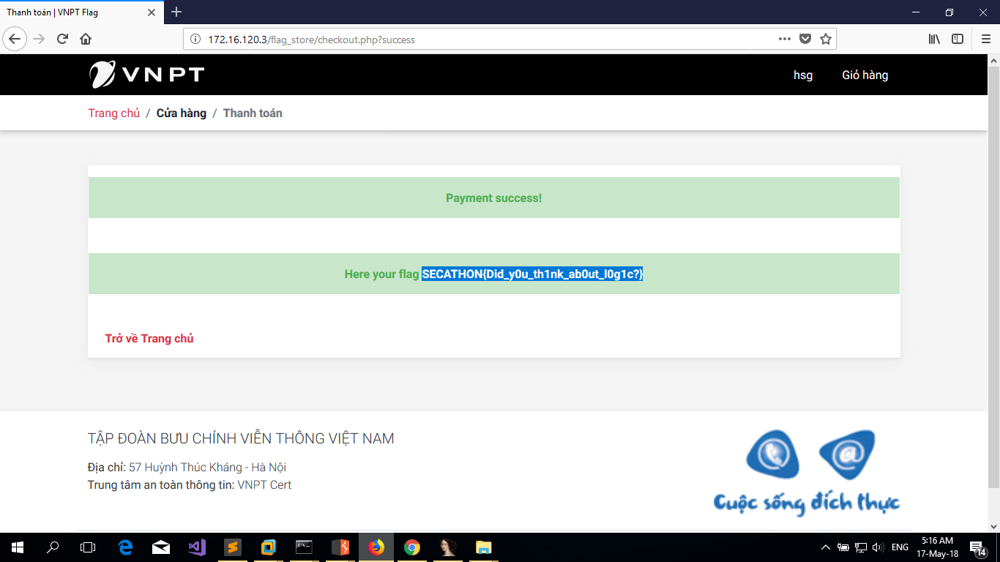

#Writeup CTF VNPT SECATHON 2018
#Web Flag Shop
Kết thúc một ngày căng thẳng với SECATHON 2018. Tạm gác lại cái chuyện kết quả, mình xin share về cách giải 1 challenge trong giải lần này *Flag shop*

Giao diện trang web giống như trang web bán hàng bình thường mà ta dùng hàng ngày. Đầu tiên trang web có chức năng đăng ký và đăng nhập. Lần đầu mình nghĩ lỗi ở đây nhưng sau 1 lúc mò mẫm đã bỏ cái ý định này ngay. Mình đã đăng ký 1 tài khoản và đăng nhập vào, vì chỉ có đăng nhập mới mua được hàng:

Đáng chú ý ở đây là trang thanh toán, Với cái hint to đùng là mua hàng thành công sẽ có được flag. Tất nhiên là với tài khoản bình thường sẽ không mua được hàng vì tài khoản bằng 0. Do đó ta phải tìm cách để vượt qua đăng nhập ở bài này. Ta chú ý lại khi thêm giỏ hàng có chức năng điều chỉnh số lượng của sản phẩm, điều gì xảy ra khi số lượng bằng 0, tất nhiên là khi đó giá trị ta phải trả sẽ bằng 0:

Tuy nhiên khi chỉnh số lượng về 0 từ trình duyệt sẽ không được vì có chương trình check, ta sử dụng công cụ Burp Suite chỉnh lại số lượng hàng hóa về 0 khi gửi lên server

Sau khi chỉnh sửa trong gió hàng sẽ có sản phẩm với số lượng bằng 0. Đây là lỗi logic lập trình và kết quả ta mua được hàng nhưng thật không may ta chưa có được flag:

Từ đây có thể kết luận flag nó nằm đâu đó trong các sản phẩm kia, có hàng chục sản phẩm, nếu mua bằng tay từng cái 1 thì try hard quá. Thôi mình lười tìm cách nào nhanh nhất. Ta để ý thông tin burpsuite bắt được khi gửi số lượng sản phẩm lên server có 2 biến đó là num số lượng sản phẩm và id sản phẩm. Do đó ta có thể tự động thêm hàng loạt sản phẩm bằng cách thay đổi id và num=0. Ta dùng sẵn công cụ Intruder trong Burpsuite:

Sau khi chạy ta load lại trên trình duyệt thì thấy đã tự đông thêm tất cả các sản phẩm vào giỏ hàng với số lượng bằng 0. Tiến hành thanh toán và kết quả:

